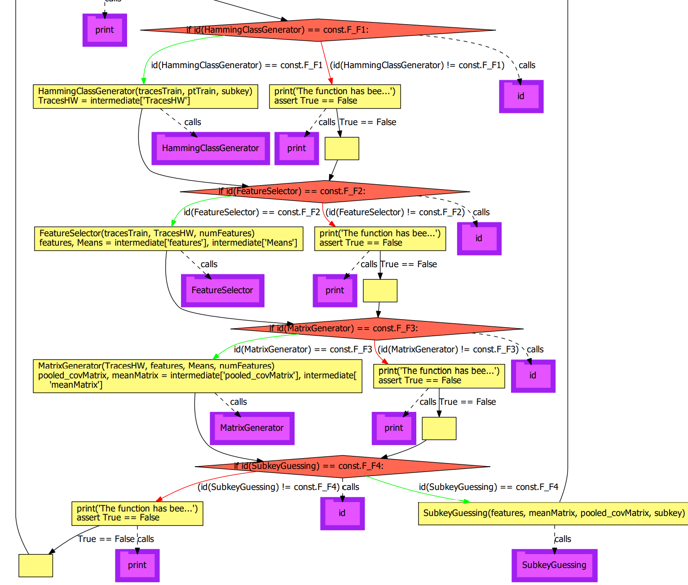
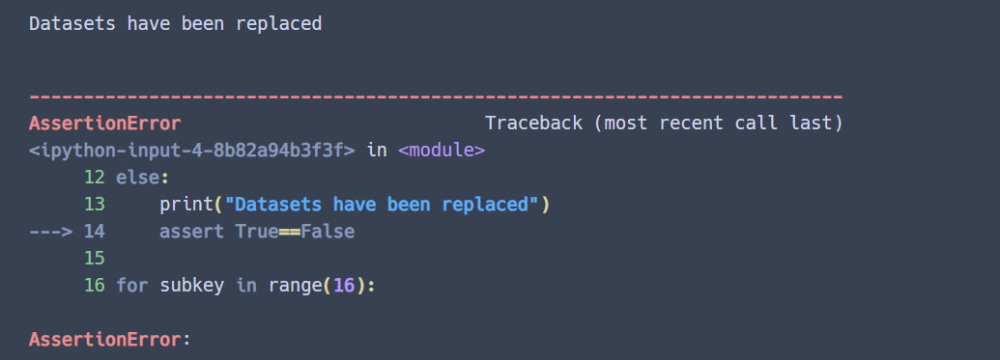
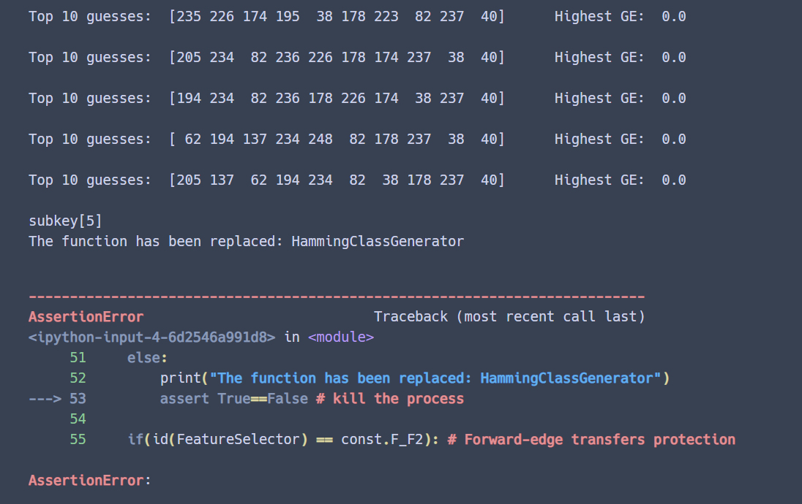
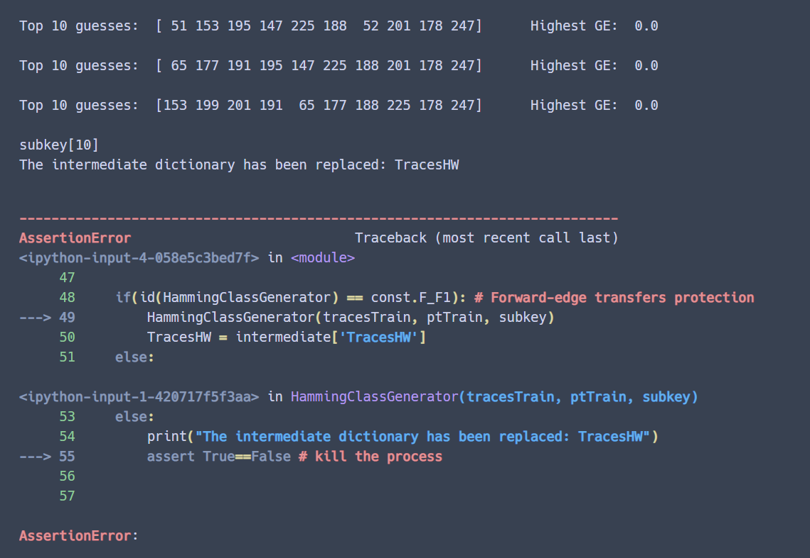
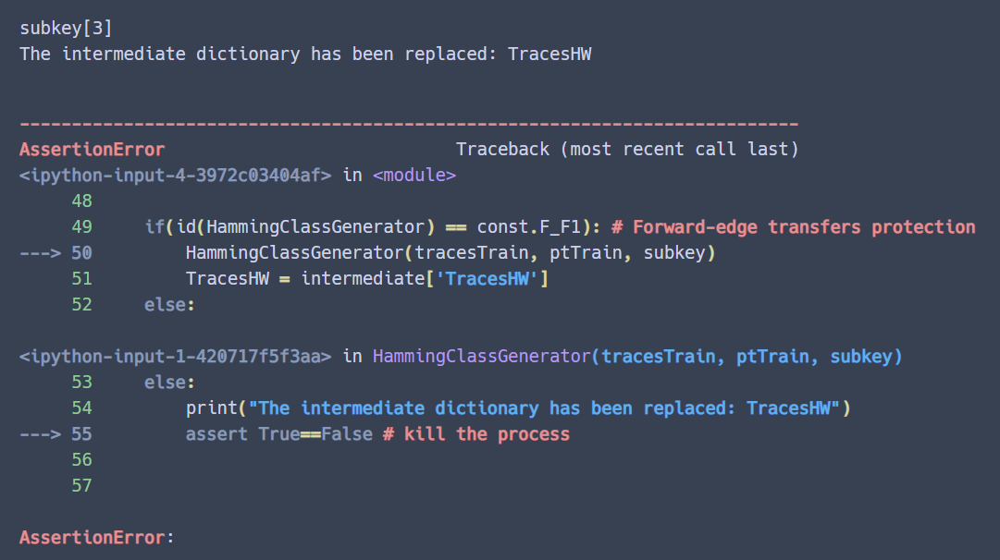

# Control Flow Integrity
Project Website: https://gitlab.utwente.nl/s2694328/CS4150-SystemSecurity/-/tree/main/lab3_CFI

## Vulnerability & Countermeasure
In the original pool template attack program, the flows are not in control, as consequence, attackers can insert or redirect the flows which are not intended by the original program - control flow hijacking. The countermeasure is applying software-based Control Flow Integrity - each flow has a unique ID such that only legitimate ones can be executed. 

## CFI Implementation
In order to carry out CFI in the program, firstly, the Control Flow Graph of the original program ([origin_TA.py](origin_TA.py)) has been drawn in [origin_CFG.pdf](origin_CFG.pdf). Obviously, there is no `if` statement checking before any flow instructions. In order to check the validation, the IDs should be assigned to the instructions. For convenience, we chunk the whole program into several functions:
- HammingClassGenerator: the function to generate the Hamming distance classes
- FeatureSelector: the function to select the points of interest
- MatrixGenerator: the function to generate the covariance and probabilistic model
- SubkeyGuessing: the function to guess a subkey

As result, the program becomes a loop where several functions are called periodically. In Python, the variable cannot be declared before being assigned a value, therefore, the location of the variable is dynamic. In addition, when the variable is reassigned, its memory address may also change. In this situation, it is not simple to emulate the backward-edge transfers in Python. To solve this, we used a dictionary that can be assigned a constant address id and the id will not change when the inside elements are updated (the address of the elements inside will change, unfortunately).

In order to simulate the Control Flow Integrity, there are 3 assumptions:
- The attacker can only carry out a run-time attack which means that the attack only happens inside the loop. This assumption does not betray the reality, because most programs only run global setting once and then stagnate in the main function or main loop.
- The attacker cannot bypass the `id` checking by using fault attacks, since  CFI cannot protect the flow control and fault injection at the same time.
- The attacker cannot directly modify the original functions, but he can change the calling address by re-writing the function.

The general countermeasures are listed below for different flows:
- The direct control-flow transfers will be protected by read-only mode - the attacker who wants to corrupt the memory is required to disable the read-only protection bit first.
- Indirection function calls will be protected by ID check that any function only with matching signature is allowed during runtime.
    - For forward-edge transfers, the code is instrumented with some form of equivalence check, e.g. an `if` conditional statement.
    - For backward-edge transfers, the return can only go to the most recent prior caller.

 We used the `id()` address as the identification for a function flow and applied the *contant.py* library to make the `id` not changeable once the value is given. For example, the following program will cause an error because the constant variable is reassigned. 
```python
# this library is for making a variable constant
# like final in java or const in C/C++
import constant

constant.VALUE = 1
constant.VALUE = 2

# out:
# ConstError: Can't change const VALUE
```

We used that `id`s as references. Before calling a function or execute a flow, there is an extra verification where the function's `id` will be compared with the recorded one to ensure there is no corruption. Besides, before the function return values back to the dictionary, it will checks whether the address of the dictionary is modified so as to avoid redirection. The Control Flow Graph of the current program (add_CFI) is presented in [add_CFI_CFG.pdf](add_CFI_CFG.pdf). The following figure shows a part of the CFG where the orange `if` conditional statements are for the `id` checking.

 


## Attacking & Result
The program with CFI is written in [add_CFI.ipynb](add_CFI.ipynb) and [add_CFI.py](add_CFI.py) and both can be used for testing. In the program, there are already some implemented attacks but are "commented", and they can be "uncommented" for running. There are totally four attacking scenarios:
- scenario 1: the attacker replaces the dataset with his own's which will be protected by read-only.
- scenario 2: the attacker replaces a function with his own's which will be protected by the forward-edge transfers checking.
- scenario 3: the attacker corrupts the returning address which will be protected by the backward-edge transfers checking.
- scenario 4: the attacker inserts a new element into the dictionary which will be protected by the backward-edge transfers checking. 

The results are shown below, after the program detects the corruptions, it will using `assert` error to stop the running process and issue where the corruption occurs.

scenario 1


scenario 2


scenario 3


scenario 4


Furthermore, adding CFI checking to some extent will also delay the program:
