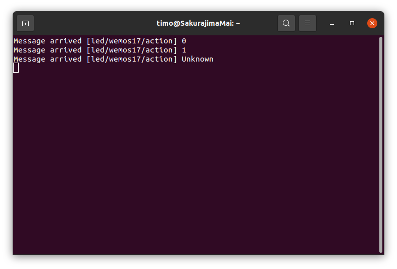
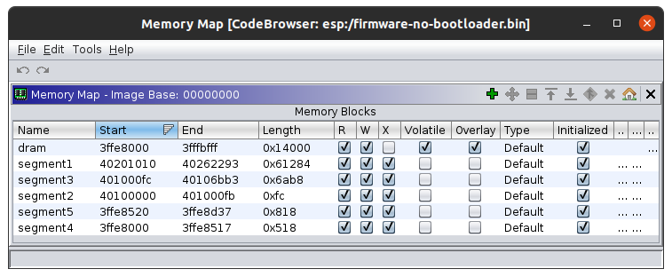
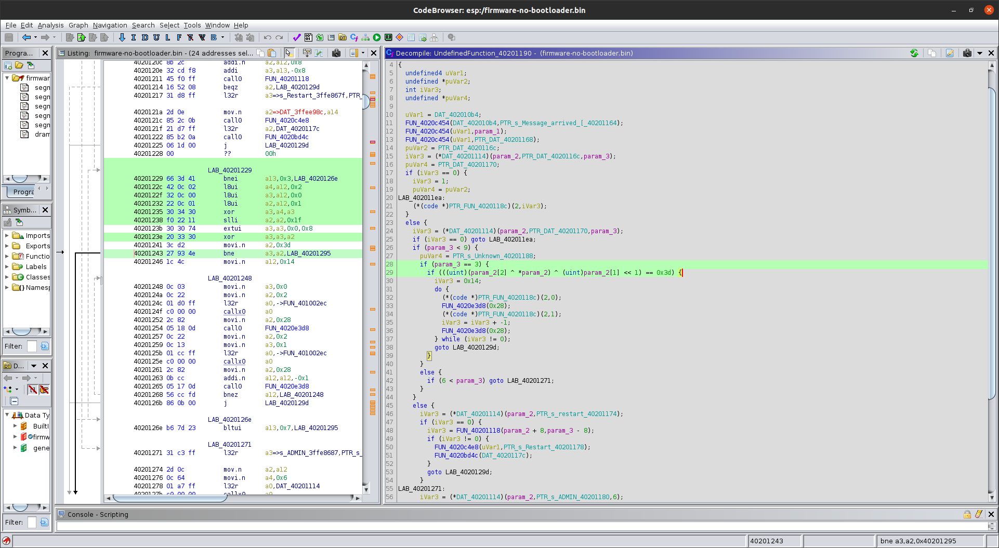
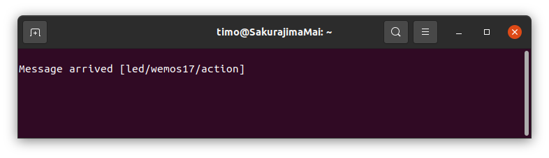
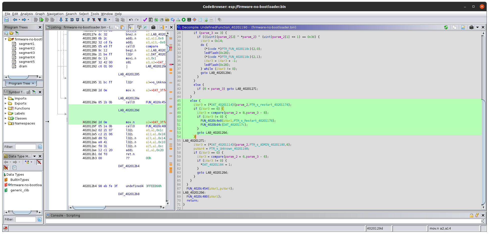
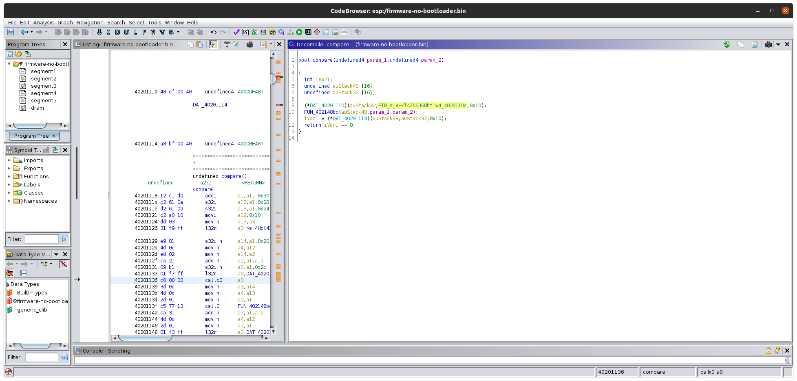
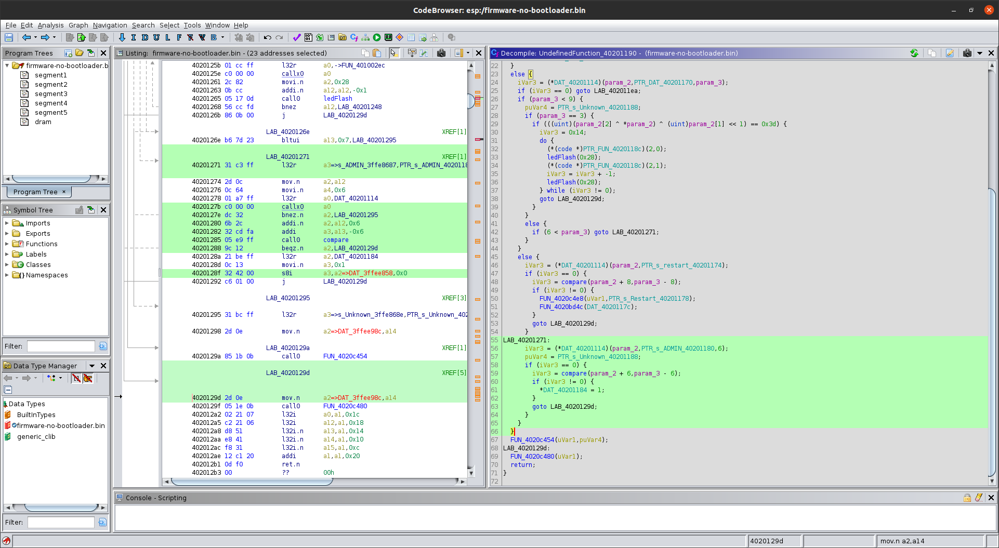

# Find All Hidden Commands in The Firmware
Project Website: https://gitlab.utwente.nl/s2694328/CS4150-SystemSecurity/-/tree/main/labOther_Hidden_Commands_in_Firmware

## Tools Used
- Python3
- Ghidra with Xtensa
- Mosquitto client and Mosquitto
- esptool
- Wireshark
- WiHotspot

## WiFi Hotspot Set Up
Since my computer has no port for ethernet cable, I found another solution to deal with this problem which was using *wihotspot*. The *wihotspot* allows Linux to connect the WiFi and share it using the hotspot at the same time. The installation procedure has been shown below.

1. To clone the latest package,
   ```powershell
   git clone https://github.com/lakinduakash/linux-wifi-hotspot

   cd linux-wifi-hotspot
   ```
2. To install the dependencies,
    ```powershell
   sudo apt install -y libgtk-3-dev build-essential gcc g++ pkg-config make hostapd
    ```
3. To build and install it,
   ```powershell
   make

   sudo make install
   ```
4. To run it,
   ```powershell
   wihotspot
   ```

After using the commands above, the UI will appear like the figure below. 


For convenience, the SSID and password are set to "syssec" and "systemsec" respectively. The wifi interface and internet interface are both set to `wlp2s0` and it will generate a virtual `ap0` network.

In so far, the hotspot has been built up and can be searched by other devices. 

## To Redirect & Monitor The Flow
In order to send the mqtt message to the esp board and observe the response, we used local mosquitto to emulate the server and use the serial port to monitor the response.

1. Set up mosquitto server:
   ```powershell
   mosquitto -p 8888
   ```

1. Redirect mqtt receiving port 1883 - it can be known by using Wireshark - to 8888:
    ```powershell
    sudo iptables -t nat -A PREROUTING -i ap0 -p tcp --dport 1883 -j REDIRECT --to-port 8888
    ```

1. Mointer the serial port:
    ```powershell
    # without logging
    screen /dev/ttyUSB0 115200

    # with logging
    screen -L -Logfile ./espOutput.log /dev/ttyUSB0 115200
    ```

1.  Publishing Test:
    ```powershell
    mosquitto_pub -h localhost -p 8888 -t led/wemos17/action -m 0

    mosquitto_pub -h localhost -p 8888 -t led/wemos17/action -m 1

    mosquitto_pub -h localhost -p 8888 -t led/wemos17/action -m a
    ```

    The serial port prints:
    

## Ghidra for Finding More
According to the previous testing result, we noticed that if the command does not exist, the response will be *Unknown*. We can use Ghidra to see where the program outputs *Message arrived* with *Unkown* and what is the conditional statement. 

### Read Flash
To extract the raw program from the flash, esptool.py should be used.
```powershell
esptool.py --baud 115200 read_flash 0x0 0x400000 firmware.bin
```

To segment the raw data:
```powershell
dd if=firmware.bin of=firmware-no-bootloader.bin bs=4k skip=1
```

To observe the information of segments:
```powershell
esptool.py image_info firmware-no-bootloader.bin

# output
Segment 1: len 0x62184 load 0x40201010 file_offs 0x00000008 [IROM]

Segment 2: len 0x000fc load 0x40100000 file_offs 0x00062194 [IRAM]

Segment 3: len 0x06ab8 load 0x401000fc file_offs 0x00062298 [IRAM]

Segment 4: len 0x00518 load 0x3ffe8000 file_offs 0x00068d58 [DRAM]

Segment 5: len 0x00818 load 0x3ffe8520 file_offs 0x00069278 [DRAM]
```

### Ghidra Auto Analysis
After running Ghidra, the raw program can be loaded into it by using the setting below:


After auto analysis, using search to locate the `string==Unknown`, we found that both *Message arrived* and *Unknown* are used in `UndefinedFunction_40201190`. We suspected that this the function to process the mqtt message. It has three input arguments - `undefined4 param_1`,`byte *param_2`,`uint param_3`. After reading the body of this function, we conjectured that `param_2` is the pointer to a byte array where ASCII message is stored and `param_3` is the length of the message. When `iVar3` is greater than 0, it stays in the while loop where the led flashes. `FUN_4020e3d8` is the function for time delay. `*(code *)PTR_FUN_4020118c)(2,0)` and `*(code *)PTR_FUN_4020118c)(2,1)` control the off/on of LED. 



It always respond `PTR_s_Unknown_40201188` besides when `param_3==3` and `(uint)(param_2[2] ^ *param_2) ^ (uint)param_2[1] << 1) == 0x3d`. In this situation, we thought that the length of the message should equal to 3 and the three ASCII bytes should follow the above rule. In order to verify our speculation, we used "a28" to do the test because `ord('8')^ord('a')^(ord('2')<<1)==0x3d`. 
```powershell
mosquitto_pub -h localhost -p 8888 -t led/wemos17/action -m a28
```

After the command is transmitted, the led is flashing while the serial port does not print *Unkown*. Thus, the speculation is valid. 


## Search Commands & Validation
We made a simple python script that could solve the commands within few seconds.

To run the script, it will generate a file named `commands.txt` where all the commands are included.
```powershell
python3 search.py
```

In addition, in order to validate the commands, we made a script to send commands one by one to the board and recorded responses. Since the speed of processing command is quite slow and mqtt is not quite reliable for the transmission, it needs an extra delay between two consecutive commands, otherwise, some messages might be lost. 

To run the script:
```powershell
# to record reaction
screen -L -Logfile ./espOutput.log /dev/ttyUSB0 115200

# it will take you about an hour to validate all commands.
python3 validation.py
```

The file named `commands` includes all the commands for making the LED flash.

## Restart Command
Besides the commands for flashing, we also found a command for restarting the board. In the figure below, it shows that if the first 8 bytes equal to `restart `, it will compare the remaining bytes with something. 



We entered that function for the comparison and found that it compares the rest of the bytes with `4Hxl4Z69J6Uht1w4`. 



Then, we passed the message `'restart 4Hxl4Z69J6Uht1w4'` to the board and it would restart after receiving the mqtt package.

```powershell
# input
mosquitto_pub -h localhost -p 8888 -t led/wemos17/action -m 'restart 4Hxl4Z69J6Uht1w4'

# output
Message arrived [led/wemos17/action] Restart

ets Jan  8 2013,rst cause:2, boot mode:(3,7)

load 0x4010f000, len 3584, room 16 
tail 0
chksum 0xb0
csum 0xb0
v2843a5ac
~ld
*WM: 
*WM: AutoConnect
*WM: Connecting as wifi client...
*WM: Status:
*WM: 6
*WM: Using last saved values, should be faster
*WM: Connection result: 
*WM: 3
*WM: IP Address:
*WM: 192.168.12.2
connected...yeey :)
*WM: freeing allocated params!
syssec.ewi.utwente.nl
Attempting MQTT connection...connected
```

## ADMIN Command
Similar to the Restart command, in the figure below, it shows that if the first 6 bytes equal to `ADMIN ` and the rest bytes equal to the correct password `4Hxl4Z69J6Uht1w4`. If the verification is passed, it will set `*DAT_40201184 = 1`.



## Appendix
### search.py
```python
#!/usr/bin/env python
# coding: utf-8

# In[1]:
ascii_start = 0x20
ascii_end = 0x7E

# In[2]:
f = open("./commands.txt", "a+")

for param2_0 in range(ascii_start, ascii_end + 1):
    for param2_1 in range(ascii_start, ascii_end + 1):
        for param2_2 in range(ascii_start, ascii_end + 1):
            if (((param2_2 ^ param2_0) ^ (param2_1 << 1)) == 0x3D):
                command = chr(param2_0) + chr(param2_1) + chr(param2_2)
                f.write(command + '\n')

f.close()
```
### validation.py
```python
import os
from time import sleep

f = open("./commands.txt", "r")
command = True
while(command):
    command = f.readline()[:-1]
    command = command.replace("'", "'\"'\"'")
    os.system("mosquitto_pub -h localhost -p 8888 -t led/wemos17/action -m " + "'" + command + "'")
    sleep(2)
f.close()
```